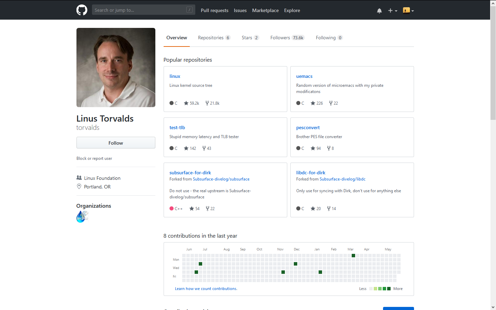
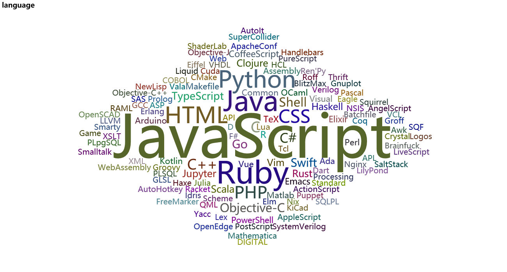

# GithubSpider
## 爬一爬全球最大的同性交友网站 :eyes:
- 爬取用户及仓库信息
- 基于Scrapy，但其中也用到了requests，水平有限   :grin:
## 从自己账号开始，爬了2700用户及25000仓库，数据还是相当少的，**重在娱乐，不具代表性** :point_left: 
## user
### 根据用户的followers排名，寻找大佬的方式 :stuck_out_tongue_closed_eyes:
| No. | user | num_followers |
|-|:-:|-:|
| 1 | https://github.com/jamiebuilds | 4300|  
| 2 | https://github.com/mattn | 4100  
| 3 | https://github.com/mafintosh | 3800
| 4 | https://github.com/yanhaijing | 3100
| 5 | https://github.com/DIYgod | 3100
| 6 | https://github.com/yangshun | 2100  
| 7 | https://github.com/tmm1 | 2100  
| 8 | https://github.com/AdiChat | 2000
| 9 | https://github.com/andrew	| 1700 
| 10 | https://github.com/nelsonic | 1600
## 数据还是太少，都没有[torvalds](https://github.com/torvalds)，图上已有73.6k :muscle:
- 

## repo
### 仓库star排名
| No | repo | num_star |
|-|:-:|-:|
| 1 | https://github.com/CoXier/LowPoly | 888
| 2 | https://github.com/mattn/goreman | 864
| 3 | https://github.com/iobridge/thingspeak | 855
| 4 | https://github.com/linesh-simplicity/translation-spring-mvc-4-documentation	| 837
| 5 | https://github.com/mafintosh/turbo-http | 836
| 6 | https://github.com/mafintosh/hyperdrive	| 833
| 7 | https://github.com/DIYgod/Resume | 828
| 8 | https://github.com/mafintosh/is-my-json-valid	| 818
| 9 | https://github.com/marcusolsson/goddd | 796
| 10 | https://github.com/tmm1/rblineprof | 743
### 再来看下以python为主的仓库的star排名
| No | repo | num_star |
|-|:-:|-:|
| 1 | https://github.com/kingfengji/gcForest | 581
| 2 | https://github.com/kvfrans/deepcolor | 305
| 3 | https://github.com/kvfrans/variational-autoencoder	 | 287
| 4 | https://github.com/DIYgod/EasyGoAgent	| 191
| 5 | https://github.com/kvfrans/generative-adversial | 132
| 6 | https://github.com/proxypoke/quickswitch-for-i3 | 132
| 7 | https://github.com/hengruo/QANet-pytorch | 125
| 8 | https://github.com/wzpan/Learn-Python-The-Hard-Way	| 123
| 9 | https://github.com/kvfrans/feature-visualization | 87
| 10 | https://github.com/penafieljlm/inquisitor | 86
## 其他相关排名可以运行read_mysql，可以写其他的排名
## 然后是对爬取到的仓库语言进行统计，很明显，JavaScript在仓库语言中的比重最大 :no_mouth:
- 

## 学习了学习了，发现了大佬，可以更好地交友了 :+1:
